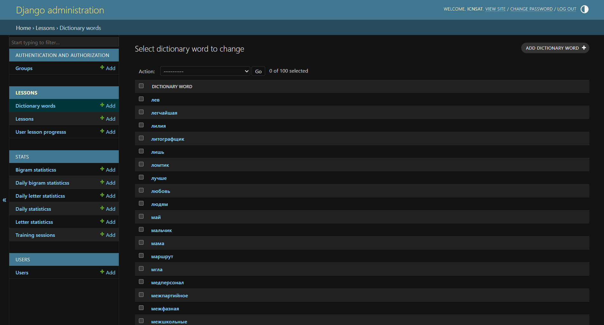
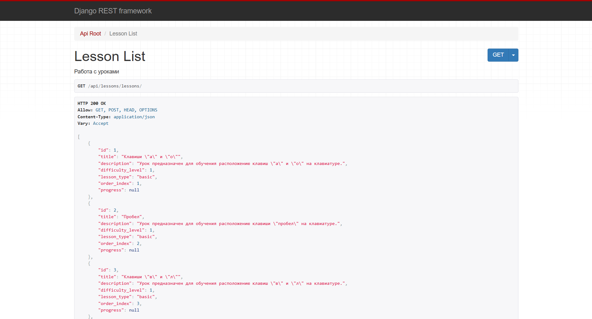
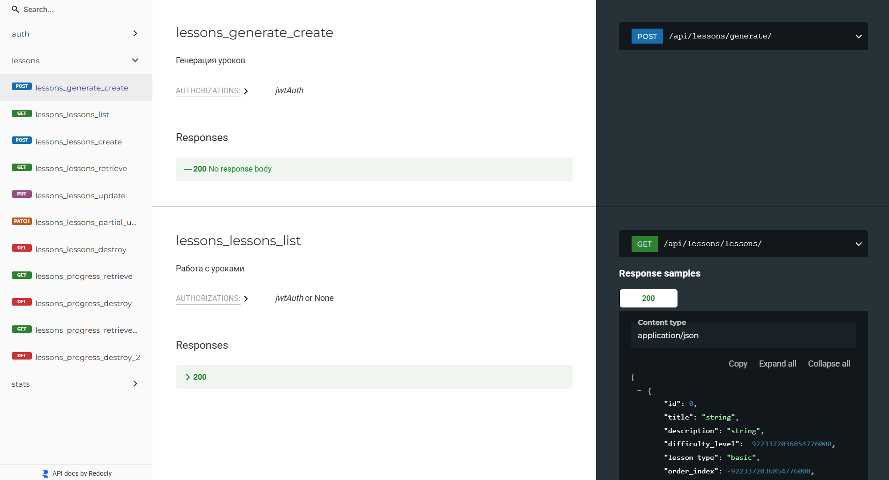
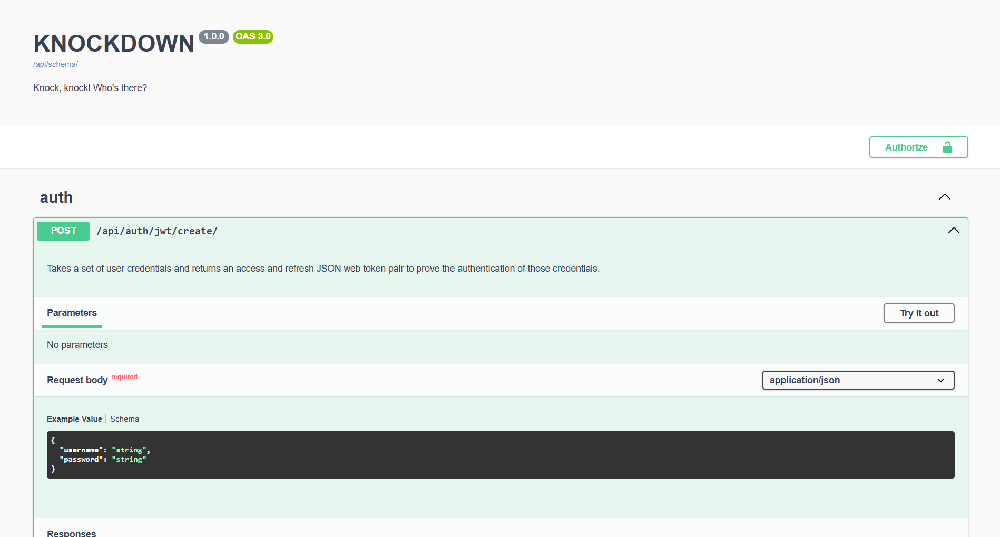

# KNOCKDOWN - backend

Серверная часть веб-приложения для обучения слепому методу печати с адаптивной системой упражнений.

> [!NOTE] 
> Клиентская часть приложения доступна в репозитории [knockdown-frontend](https://github.com/icnsat/knockdown-frontend).

## Используемые технологии

- Python
- Django REST framework
- SQLite (при локальной разработке) / PostgreSQL (при хостинге на Vercel с использованием сервиса Neon)

## URLs

### Пользовательские:

- Аутентификация
  - `POST`    `/api/auth/users/`          - Зарегистрироваться
  - `POST`    `/api/auth/jwt/create/`     - Создать токены
  - `GET`     `/api/auth/users/me/`       - Получить данные о пользователе

- Уроки и рогресс обучения
  - `GET`     `/api/lessons/lessons/`      - Получить список всех уроков с прогрессом пользователя 
  - `GET`     `/api/lessons/lessons/{id}/` - Получить детали урока с прогрессом пользователя
  - `POST`    `/api/lessons/generate/`     - Сгенерировать урок по проблемным зонам (буквы или биаграммы)
  - `GET`     `/api/lessons/progress/`     - Получить прогресс (лучшие показатели) по всем урокам
  - `GET`     `/api/lessons/progress/{id}` - Получить прогресс (лучший показатель) для одного урока

- Статистика
  - `GET`     `/api/stats/sessions/`       - Получить все тренировочные сессии
  - `POST`    `/api/stats/sessions/`       - Создать тренировочную сессию (с автоматическим обновлением прогресса, статистики по буквам и биграммам)
  - `GET`     `/api/stats/sessions/{id}/`  - Получить детали одной тренировочной сессии
  - `DELETE`  `/api/stats/sessions/{id}/`  - Удалить тренировочную сессию
  - `GET`     `/api/stats/dashboard/`      - Получить краткую агрегированную статистику пользователя
  - `GET`     `/api/stats/daily/`          - Получить полную агрегированную статистику пользователя за 30 дней
  - `GET`     `/api/stats/letters/`        - Получить статистику по проблемным буквам
  - `GET`     `/api/stats/bigrams/`        - Получить статистику по проблемным биграммам


### Системые:

- `admin/`     - Админ-панель
- `api/docs/`  - Интерактивная документация Swagger UI
- `api/redoc/` - Альтернативная документация ReDoc

|||
|-|-|
|||

## Запросы
При работе с серверной частью напрямую, без клиентской, большинство конечных точек требуют ручное добавление JWT токена авторизации в заголовок запроса:

```sh
# Получение JWT токенов
curl -X POST http://localhost:8000/api/auth/jwt/create/  \
-H "Content-Type: application/json" \
-d '{
  "username": "icnsat",
  "password": "***************"
}'

# Ответ
{
    "refresh": "<some-refresh-token>",
    "access": "<some-access-token>"
}

# Генерация урока
curl -X POST http://localhost:8000/api/lessons/generate/ \
-H "Content-Type: application/json" \
-H "Authorization: Bearer <some-access-token>" \
-d '{
  "type": "letters"
}'

# Ответ
{
    "title": "Тренировка букв: а, о, е, и",
    "content": "август алфавит автощётка безмыслие аквариум",
    "difficulty_level": 1,
    "lesson_type": "problem_letters",
    "word_count": 5
}
```

## Установка и запуск

Для работы требуется установить зависимости, применить миграции для БД, а также заполнить словарь для генерации уроков:

```sh
# Установка зависимостей
python -m venv venv
source venv/Scripts/activate

pip install --upgrade pip
pip install -r requirements.txt

# Применение миграций
cd knockdown

python manage.py makemigrations users
python manage.py makemigrations lessons
python manage.py makemigrations stats
python manage.py makemigrations

python manage.py migrate users
python manage.py migrate lessons
python manage.py migrate stats
python manage.py migrate

# Заполнение словаря
python scripts/populate_dictionary.py
```

> По умолчанию словарь заполняется словами из файла `russian_dict.txt`, лежащего в одной папке со скриптом `populate_dictionary.py`.
Можно менять наполнение файла со словами или использовать другой текстовый файл, предварительно измененив скрипт.

Чтобы запустить приложение, необходим файл `.env` в корне проекта, например:

```ini
# Django
DJANGO_SECRET_KEY=django-insecure-key
DEBUG=true

# База данных
LOCAL=true

# Настройки для удалённой БД
PGDATABASE=ndb_database
PGUSER=user
PGPASSWORD=password
PGHOST=host.aws.neon.tech
PGPORT=host

# JWT
SECRET_KEY=:)
```

Для работы с админ-панелью требуется создать суперпользователя:

```sh
python manage.py createsuperuser
```

Для запуска сервера выполнить команду:

```sh
python manage.py runserver
```

Сервер будет запущен на `localhost:8080`.


<!--
Back -> Lesson Retrieve -> Front
Front -> Stats (total; letters & bigrams agr) -> Back

Example:

POST /api/stats/sessions/
{
  "lesson": 1,
  "total_duration_seconds": 180,
  "total_characters_typed": 500,
  "total_errors": 15,
  "average_speed_wpm": 125,
  "accuracy_percentage": 96.5,
  "started_at": "2024-11-10T14:00:00Z",
  "finished_at": "2024-11-10T14:03:00Z",
  
  "letter_stats": [
    {"letter": "а", "occurrences": 15, "errors": 2, "average_hit_time_ms": 120},
    {"letter": "о", "occurrences": 8, "errors": 1, "average_hit_time_ms": 150}
  ],
  "bigram_stats": [
    {"bigram": "ао", "occurrences": 5, "errors": 1, "average_transition_time_ms": 130},
    {"bigram": "оа", "occurrences": 4, "errors": 0, "average_transition_time_ms": 110}
  ]
}
-->

<!--
TODO:
1) Decide what to do with this:
- GET /api/lessons/recommended/ - рекомендованные уроки
2) Lessons are being generated using error rate. Consider speed?
-->
